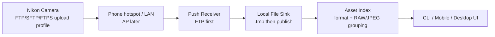

# Nikon Wireless Importer PRD

## 1. Product Positioning

Nikon Wireless Importer is a local wireless import receiver for Nikon cameras. The current route is push-based: the camera sends JPEG, NEF, and video files to a receiver running on the phone, computer, or later a NAS.

One-line positioning:

> A local Nikon wireless import receiver.

## 2. Current Technical Decision

The previous PTP/IP pull route is deprecated for this project. Real-camera validation showed that an already-paired Nikon workflow can reject a generic direct PTP/IP client and may be owned by Nikon's official receiver process. We will not continue reverse pairing or authentication work.

Current priorities:

1. FTP push mode.
2. SFTP push mode.
3. FTPS push mode.
4. AP mode remains the original camera-hotspot meaning, but is paused.

## 3. Users

- Field photographers who need quick local transfer without a card reader.
- RAW+JPEG shooters who need grouped imports and clear file sizes.
- Desktop/NAS users who want repeatable receiver-side ingest.
- Technical validators who need a compatibility table across Nikon bodies and firmware versions.

## 4. Core Scenarios

### 4.1 Phone Hotspot Or LAN FTP Push

1. User starts the receiver on phone/computer.
2. App shows receiver IP, port, protocol, username, and output folder.
3. User configures the Nikon camera FTP upload profile.
4. Camera sends files to the receiver.
5. App atomically publishes completed files and groups RAW/JPEG pairs.

### 4.2 Desktop Batch Receiver

1. User starts FTP receiver on Windows/macOS/Linux.
2. Camera sends selected files or a batch.
3. Receiver writes files into a configured folder.
4. App skips unsafe paths and records transfer status.

### 4.3 AP Mode

AP mode still means the camera creates its own Wi-Fi AP and the phone/computer joins it. This is not part of the current implementation milestone.

## 5. MVP Scope

P0:

- Run a local FTP receiver.
- Print camera-facing receiver settings.
- Accept passive FTP `STOR` uploads.
- Write uploaded files through a temporary file and publish only on success.
- Sanitize uploaded paths and filenames.
- Group RAW/JPEG/video assets by filename stem.
- Preserve duplicate uploads without overwriting completed files.
- Scan the receiver inbox as the product's import source.
- Record real-camera compatibility results.

P1:

- Add authentication polish.
- Add duplicate detection.
- Add transfer history.
- Add SFTP receiver.
- Add FTPS receiver.

P2:

- Resume AP-mode validation.
- Add mobile foreground/background service behavior.
- Add NAS/headless packaging.

## 6. Non-Goals

- PTP/IP direct import.
- Pairing reverse engineering.
- Remote camera control.
- Live View.
- Camera setting changes.
- Cloud sync.
- RAW decoding or image editing.

## 7. Functional Requirements

| ID | Requirement | Priority | Acceptance |
| --- | --- | --- | --- |
| RX-001 | Start local FTP receiver | P0 | Receiver listens on configured host and port |
| RX-002 | Show receiver settings | P0 | CLI/UI shows protocol, host, port, username, password status, output folder |
| RX-003 | Accept passive FTP upload | P0 | A client can upload a file through `PASV` + `STOR` |
| RX-004 | Atomic publish | P0 | Final file appears only after full upload succeeds |
| RX-005 | Safe path handling | P0 | Traversal and unsafe filename characters cannot escape output folder |
| RX-006 | Asset grouping | P0 | `DSC_1234.JPG` and `DSC_1234.NEF` appear as one group |
| RX-007 | Inbox scan | P0 | Receiver output folder can be scanned into grouped assets |
| RX-008 | Duplicate policy | P0 | Re-uploading `DSC_1234.NEF` creates `DSC_1234 (1).NEF` |
| RX-009 | Compatibility log | P0 | Each real-camera test updates `docs/compatibility.md` |
| RX-010 | SFTP route | P1 | Same storage sink can receive SFTP uploads |
| RX-011 | FTPS route | P1 | Same storage sink can receive FTPS uploads |
| AP-001 | Camera AP mode | P2 | Keep original AP meaning; resume after push path works |

## 8. Success Metrics

- FTP receiver accepts a real Nikon JPEG upload.
- FTP receiver accepts a real Nikon NEF upload.
- Completed files have correct byte length.
- Failed uploads do not leave final files.
- Duplicate uploads do not overwrite earlier completed files.
- User can configure the camera using only the receiver settings shown by the app.

## 9. Architecture

## 10. Milestones

1. Clean PTP/IP route from code and docs.
2. Build FTP receiver core and CLI smoke path.
3. Validate with one real Nikon camera in FTP mode.
4. Update compatibility table and receiver setup guide.
5. Add SFTP or FTPS based on what the real camera supports best.
6. Resume AP-mode exploration only after push import is stable.
