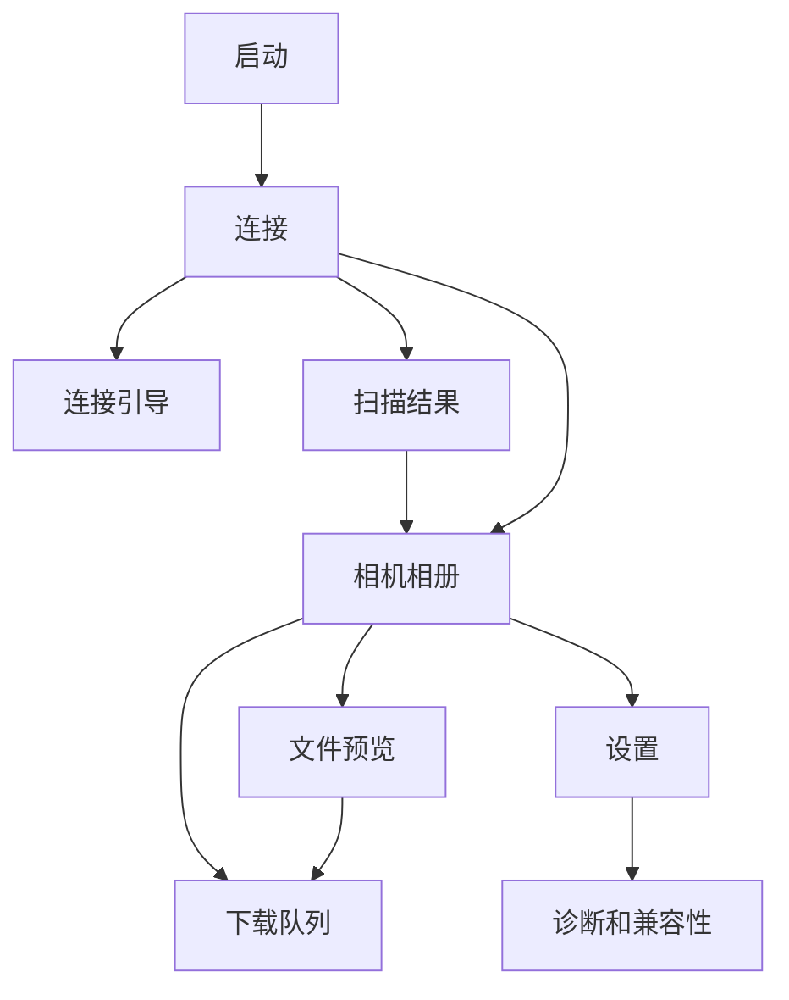

# Nikon Wireless Importer PRD

## 1. 产品概述

### 1.1 产品定位

Nikon Wireless Importer 是一个面向 Nikon 相机的无线导片工具。它不替代 SnapBridge 的全部能力，只专注一个高频任务：在手机或电脑上快速发现相机、浏览相机存储卡里的照片缩略图、选择需要的文件，并下载 JPEG、NEF、视频原文件。

一句话定位：

> 面向 Nikon 相机的无线读卡器。

### 1.2 当前问题

用户在活动现场、旅行途中或回家整理照片时，常见痛点是：

- 不想带 USB 线、读卡器或额外硬件。
- 手机连接相机 Wi-Fi 后经常断开互联网。
- 官方 App 的预览、选择和批量下载体验不稳定。
- 只想挑几张照片导出，不想完整同步全卡。
- RAW+JPEG 成对文件不好识别和选择。
- 桌面端或 NAS 自动导片没有统一工具链。

### 1.3 产品目标

V0 阶段的目标是把「相机无线导片」这条链路做稳定：

1. 连接到支持 PTP/IP 的 Nikon 相机。
2. 快速显示相机型号和文件列表。
3. 渐进加载首屏缩略图。
4. 支持选择 JPEG、NEF、视频。
5. 下载单张或批量原文件。
6. 手机热点模式下尽量保持手机互联网可用。
7. 对不兼容机型给出明确解释。

### 1.4 非目标范围

V0.1 不做：

- 遥控拍摄。
- 实时取景 Live View。
- 修改相机参数。
- BLE 自动唤醒相机 Wi-Fi。
- 云同步。
- 图片编辑。
- RAW 解码和调色。
- 完整 EXIF 管理。
- 承诺所有 Nikon 型号兼容。
- 可靠断点续传，除非真实相机验证支持。

## 2. 用户与场景

### 2.1 主要用户

#### 户外拍摄用户

需要在活动现场、旅行途中快速把几张照片导到手机，发给客户、朋友或社交平台。最在意手机不断网、连接步骤简单、下载成功率。

#### RAW 拍摄用户

经常使用 RAW+JPEG，想在手机上先看 JPEG 或缩略图，再决定是否下载 RAW。最在意 RAW+JPEG 成组展示、文件大小清晰、不要误下。

#### 桌面整理用户

回家后在电脑上批量导片，未来可能希望 NAS 自动同步。最在意稳定、可重复、可跳过已导入文件。

#### 技术验证用户

需要验证不同 Nikon 机型是否开放 PTP/IP，记录端口、命令、缩略图和下载能力。最在意 CLI、日志、兼容性表。

### 2.2 核心连接场景

#### 场景 A：手机热点模式

推荐主流程：

1. 手机开启热点。
2. 相机连接手机热点。
3. App 扫描热点网段或使用上次成功 IP。
4. App 连接相机并导片。

用户价值：

- 手机可以继续用蜂窝数据上网。
- 适合户外、旅拍、活动现场。

成功条件：

- 相机支持连接已有 Wi-Fi 或 Connect to PC 模式。
- App 能发现相机 IP 或允许手动输入。

#### 场景 B：家庭或办公室同局域网

流程：

1. 手机或电脑连接家庭/办公室 Wi-Fi。
2. 相机连接同一个网络。
3. App 扫描并连接相机。

用户价值：

- 更稳定，适合批量导片。
- 便于后续 desktop 和 NAS 自动导入。

#### 场景 C：相机 AP 模式

兜底流程：

1. 相机开启自身 Wi-Fi 热点。
2. 手机连接相机 Wi-Fi。
3. App 默认尝试 `192.168.1.1:15740`。

用户价值：

- 不依赖路由器。
- 对部分相机更容易启动。

限制：

- 手机通常会失去 Wi-Fi 互联网。
- Android 可能提示此 Wi-Fi 无互联网。

## 3. 产品版本规划

### 3.1 V0.0：Rust CLI 协议验证

目标：

证明真实相机可通过 PTP/IP 被访问。

功能：

- `scan`：扫描局域网内开放 `15740` 的设备。
- `info`：读取相机型号和能力。
- `list`：列出相机对象。
- `thumb`：下载一个缩略图。
- `pull`：下载一个原文件。

验收：

- 可连接至少一台真实 Nikon 相机。
- 可输出相机型号。
- 可列出照片文件名。
- 可下载至少一个 JPEG 和一个 NEF。
- 兼容性结果写入 `docs/compatibility.md`。

### 3.2 V0.1：Android 手动连接 Demo

目标：

把协议能力放到 Android 手机上跑通。

功能：

- 手动输入 IP 和端口。
- 连接相机。
- 显示相机型号。
- 显示照片列表。
- 首屏缩略图懒加载。
- 下载单张 JPEG 或 NEF。
- 基础错误提示。

验收：

- 手机热点或同局域网下可连接。
- 连接失败原因可理解。
- 下载失败可重试。
- 不要求后台批量下载。

### 3.3 V0.2：Android 完整体验

目标：

达到真实可用的 Android 导片体验。

功能：

- 自动扫描局域网。
- 使用上次成功 IP 快速重连。
- RAW+JPEG 合并展示。
- 文件筛选和排序。
- 批量选择和下载队列。
- 下载进度、取消、重试。
- MediaStore 保存。
- Foreground Service 保活。

验收：

- 最近 100 张照片可浏览。
- 首屏缩略图 10 秒内逐步显示。
- JPEG 出现在系统相册或图片目录。
- NEF 出现在指定 RAW 目录。
- 批量下载中断后可以重试。

### 3.4 V0.3：iOS

目标：

在 iPhone 上完成前台导片。

功能：

- Local Network 权限说明。
- 手动 IP。
- 局域网扫描。
- 文件列表和缩略图。
- JPEG 保存到 Photos。
- NEF 和视频保存到 Files 或 App Documents。

限制：

- 不承诺长时间后台批量下载。
- 局域网权限需要清晰引导。

### 3.5 V0.4：Desktop 和自动化

目标：

面向桌面批量导片和自动同步。

功能：

- macOS、Windows、Linux CLI 或 GUI。
- 指定目录保存。
- 按日期建目录。
- 跳过已存在文件。
- NAS/headless 模式。

## 4. 用户旅程

### 4.1 首次连接旅程

1. 用户打开 App。
2. App 展示推荐连接方式：手机热点模式。
3. 用户选择连接方式。
4. 如果是手动连接，输入 IP。
5. App 连接相机。
6. 连接成功后显示型号、连接模式、文件数量。
7. 进入相册列表。

关键体验：

- 用户必须知道下一步该在相机上做什么。
- 连接失败要给出可执行建议，而不是只显示错误码。

### 4.2 浏览和选择旅程

1. App 先显示文件列表骨架和元数据。
2. 首屏缩略图按可见范围加载。
3. 用户用筛选查看 JPG、RAW、视频或未下载。
4. RAW+JPEG 以一个卡片展示。
5. 用户点开预览页查看文件详情。
6. 用户选择下载 JPEG、RAW 或整组。

关键体验：

- 列表不能被缩略图阻塞。
- 缩略图失败不影响下载原文件。
- RAW 文件大小要明显展示，防止误下大文件。

### 4.3 下载旅程

1. 用户选择一个或多个文件。
2. 底部操作栏展示已选数量和预计大小。
3. 用户点击下载原图。
4. 下载页显示队列、当前文件和进度。
5. 下载成功后标记已下载。
6. 失败任务可重试。

关键体验：

- 原图下载默认并发 1，优先稳定。
- 文件先写临时文件，成功后发布。
- 中断后不能留下看似成功的脏文件。

## 5. 功能需求

### 5.1 连接

| 编号 | 需求 | 优先级 | 验收 |
| --- | --- | --- | --- |
| CON-001 | 支持手动输入 IP 和端口 | P0 | 输入 `192.168.x.x:15740` 后可连接 |
| CON-002 | 支持相机 AP 默认地址 | P0 | 一键尝试 `192.168.1.1:15740` |
| CON-003 | 支持局域网扫描 | P1 | 扫描结果渐进显示 |
| CON-004 | 记住上次成功 IP | P1 | 下次启动优先尝试 |
| CON-005 | 展示连接状态 | P0 | 未连接、扫描中、连接中、已连接、失败 |
| CON-006 | 连接失败给出建议 | P0 | 超时、未发现、权限失败有不同文案 |

### 5.2 相机信息

| 编号 | 需求 | 优先级 | 验收 |
| --- | --- | --- | --- |
| CAM-001 | 读取 manufacturer/model | P0 | 连接成功页展示型号 |
| CAM-002 | 读取 firmware/serial | P1 | 可在详情或设置中查看 |
| CAM-003 | 读取 supported operations | P0 | 用于能力探测 |
| CAM-004 | 生成兼容能力 | P0 | supports thumb/object/raw/video |

### 5.3 文件列表

| 编号 | 需求 | 优先级 | 验收 |
| --- | --- | --- | --- |
| OBJ-001 | 枚举 storage IDs | P0 | 多卡位时均可扫描 |
| OBJ-002 | 枚举 object handles | P0 | 能列出文件句柄 |
| OBJ-003 | 读取 object info | P0 | 文件名、大小、格式可显示 |
| OBJ-004 | 支持格式识别 | P0 | JPG、NEF、MOV、MP4、TIFF、Unknown |
| OBJ-005 | 按拍摄时间倒序 | P1 | 有时间时最新在前 |
| OBJ-006 | RAW+JPEG 组合 | P1 | `DSC_1234.JPG` 和 `DSC_1234.NEF` 合并 |

### 5.4 缩略图

| 编号 | 需求 | 优先级 | 验收 |
| --- | --- | --- | --- |
| THM-001 | 支持 GetThumb | P0 | 可获取 JPEG 缩略图 bytes |
| THM-002 | 懒加载可见区域 | P0 | 不一次性拉全量缩略图 |
| THM-003 | 缩略图失败不阻塞列表 | P0 | 卡片显示文件类型兜底块 |
| THM-004 | 磁盘缓存 | P1 | 再次进入列表不重复请求 |
| THM-005 | 限制并发 | P0 | 默认 2 到 4 个 |

### 5.5 下载

| 编号 | 需求 | 优先级 | 验收 |
| --- | --- | --- | --- |
| DL-001 | 下载单个对象 | P0 | JPEG/NEF 可保存到本地 |
| DL-002 | 下载进度 | P0 | 展示当前文件和百分比 |
| DL-003 | 临时文件策略 | P0 | 失败不发布最终文件 |
| DL-004 | 下载失败重试 | P0 | 用户可重新发起任务 |
| DL-005 | 批量下载队列 | P1 | 多任务排队执行 |
| DL-006 | 取消任务 | P1 | 等待和下载中任务可取消 |
| DL-007 | Android MediaStore | P1 | JPEG/视频进入系统媒体库 |
| DL-008 | Foreground Service | P2 | 长时间批量下载不易被杀 |

### 5.6 设置和兼容性

| 编号 | 需求 | 优先级 | 验收 |
| --- | --- | --- | --- |
| SET-001 | 显示保存位置 | P1 | 用户知道文件在哪里 |
| SET-002 | 显示兼容性状态 | P1 | 当前机型能力可查看 |
| SET-003 | 导出诊断日志 | P2 | 日志不包含图片内容或隐私 EXIF |
| SET-004 | 管理历史相机 | P2 | 可删除历史 IP |

## 6. 非功能需求

### 6.1 性能

- 连接成功后 3 秒内显示文件列表元数据。
- 10 秒内逐步显示首屏缩略图。
- 首次最多加载最近 300 个对象，支持继续加载。
- 原图下载并发默认 1。
- 缩略图并发默认 2 到 4。

### 6.2 稳定性

- 网络超时必须可配置。
- 相机断开后任务进入失败状态。
- Session 失败后尝试关闭连接。
- 下载失败不污染最终文件。
- 所有错误映射到稳定错误码。

### 6.3 隐私

- 默认不上传云端。
- 不记录图片内容。
- 不记录完整 EXIF。
- 不记录精确 GPS 坐标。
- 允许记录相机型号、固件、连接模式、错误码、格式统计、耗时。

### 6.4 可测试性

- Rust Core 必须可通过 mock camera 自动测试。
- CLI 必须能覆盖 `info/list/thumb/pull`。
- 真实相机测试结果必须沉淀到兼容性表。

## 7. 指标

### 7.1 V0 验证指标

- 至少 1 台真实 Nikon 相机完成 `info/list/thumb/pull`。
- 单张 JPEG 下载成功率达到 95% 以上。
- 单张 NEF 下载成功率达到 90% 以上。
- 连接失败时 100% 显示可执行建议。

### 7.2 V0.2 体验指标

- 首屏列表出现时间小于 3 秒。
- 首屏缩略图逐步出现时间小于 10 秒。
- 批量 20 张 JPEG 下载中无脏文件。
- 用户从打开 App 到开始下载小于 60 秒，前提是相机已入网。

## 8. 信息架构

## 9. 关键页面

### 9.1 Connect

目标：

让用户快速选对连接方式，并完成连接。

核心模块：

- 推荐方式卡片：手机热点。
- 次级方式：同局域网、相机 AP、手动 IP。
- 扫描按钮。
- 手动 IP 输入。
- 最近连接记录。
- 连接状态和错误建议。

### 9.2 Gallery

目标：

让用户快速浏览、筛选、选择要下载的文件。

核心模块：

- 顶部相机状态。
- 筛选分段控件。
- 排序入口。
- 网格列表。
- RAW+JPEG 角标。
- 已下载标记。
- 底部选择栏。

### 9.3 Preview

目标：

让用户确认文件并选择下载粒度。

核心模块：

- 大缩略图或文件类型兜底块。
- 文件名、格式、大小、拍摄时间。
- 下载 JPEG。
- 下载 RAW。
- 下载整组。

### 9.4 Downloads

目标：

让用户知道下载是否还在安全进行。

核心模块：

- 当前任务。
- 总进度。
- 队列列表。
- 失败原因。
- 重试和取消。

### 9.5 Settings

目标：

管理保存位置、隐私说明、兼容性信息。

核心模块：

- 保存路径。
- 当前相机能力。
- 历史连接。
- 诊断日志。
- 隐私说明。

## 10. 错误文案

| 错误 | 用户文案 |
| --- | --- |
| CameraNotFound | 没有发现相机。请确认相机已经连接到手机热点或同一个 Wi-Fi，然后重新扫描。 |
| ConnectionTimeout | 连接超时。相机可能已经休眠，或当前网络无法访问相机。 |
| LocalNetworkPermissionDenied | 需要允许访问本地网络，App 才能发现和连接相机。 |
| ThumbnailUnavailable | 这张照片无法读取缩略图，但仍然可以尝试下载原文件。 |
| DownloadInterrupted | 下载中断。请保持相机开启并靠近手机，然后重试。 |
| UnsupportedOperation | 当前相机不支持这个操作。你仍可以尝试其他连接模式或查看兼容性说明。 |

## 11. 发布条件

### 11.1 V0.0 发布条件

- Mock camera 自动测试通过。
- CLI 对真实相机完成 `info/list/thumb/pull`。
- 至少记录一条兼容性结果。
- 下载失败不产生最终文件。

### 11.2 V0.1 发布条件

- Android 可手动连接真实相机。
- 可显示相机型号。
- 可显示最近照片列表。
- 可加载首屏缩略图。
- 可下载 JPEG 和 NEF。
- 关键错误都有用户文案。

### 11.3 V0.2 发布条件

- 支持局域网扫描。
- 支持 RAW+JPEG 合并展示。
- 支持批量下载和重试。
- 支持 MediaStore 保存。
- 长下载任务有前台通知。

## 12. 待确认问题

这些问题不阻塞 V0.0，但会影响 V0.2 以后体验：

- 首批重点兼容的 Nikon 型号是哪几台。
- 是否优先支持 Z 系列，还是兼顾 DSLR。
- Android 首版保存到系统相册还是 App 私有目录。
- 是否需要用户可配置保存目录。
- 是否需要 iPad 和桌面端优先级提前。
- 是否计划做商业化或仅自用工具。

