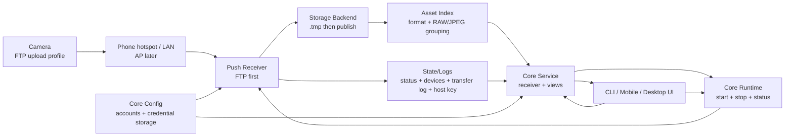

# Camera Connector PRD

## 1. Product Positioning

Camera Connector is a local wireless import receiver for cameras. The current route is push-based: the camera sends JPEG, RAW, and video files to a receiver running on the phone, computer, or later a NAS.

One-line positioning:

> A local camera push import receiver.

Current product direction extends that receiver into a project-scoped photo
triage tool: imports are grouped under shooting projects, local CV catches
obvious technical risks, configured models evaluate photography quality, and
users keep their own favorites/marks separate from algorithm results.

## 2. Current Technical Decision

The previous brand-specific PTP/IP pull route is deprecated for this project. Real-camera validation showed that an already-paired workflow can reject a generic direct PTP/IP client and may be owned by an official receiver process. We will not continue reverse pairing or authentication work.

Current priorities:

1. FTP push mode.
2. Android-visible secondary mode is future STC, shown as disabled until implemented.
3. AP mode remains the original camera-hotspot meaning, but is paused.

SFTP is no longer a current Android product route. The core/CLI SFTP path may
remain as an engineering validation surface, but it should not appear as a
primary user setup path before real-camera compatibility is proven.

## 3. Users

- Field photographers who need quick local transfer without a card reader.
- RAW+JPEG shooters who need grouped imports and clear file sizes.
- Desktop/NAS users who want repeatable receiver-side ingest.
- Technical validators who need a compatibility table across camera vendors, bodies, and firmware versions.

## 4. Core Scenarios

### 4.1 Phone Hotspot Or LAN FTP Push

1. User starts the receiver on phone/computer.
2. App shows receiver IP, port, protocol, username, and import save location.
3. User configures the camera FTP upload profile.
4. Camera sends files to the receiver.
5. App atomically publishes completed files into a flat output location, keeps receiver state/logs outside that output location, and groups RAW/JPEG pairs under an explicit project.

### 4.2 Desktop Batch Receiver

1. User starts FTP receiver on Windows/macOS/Linux.
2. Camera sends selected files or a batch.
3. Receiver writes all completed files into one configured flat save location, regardless of the camera's remote upload path setting.
4. App records transfer id, original camera path, final filename, remote address, and optional user-set source name for filtering and virtual display paths.

### 4.3 AP Mode

AP mode still means the camera creates its own Wi-Fi AP and the phone/computer joins it. This is not part of the current implementation milestone.

### 4.4 Project Photo Triage

1. User opens a shooting project and browses grouped photos.
2. Local CV always records technical gate results such as blur, clipping, noise,
   color cast, unsupported input, and portrait-specific subject risks when the
   project profile requires them.
3. If the project enables model evaluation and a provider profile is configured,
   upload/background jobs can evaluate single photos and burst groups.
4. Burst-group model recommendation can run automatically when enabled for the
   project. Project-level model recommendation is manual-only.
5. User favorites and user marks are independent human choices; they never
   rewrite model recommendations.

## 5. MVP Scope

P0:

- Run a local FTP receiver.
- Print camera-facing receiver settings.
- Accept passive FTP `STOR` uploads.
- Write uploaded files through a temporary file and publish only on success.
- Flatten uploaded paths to the final filename only; do not mirror camera-side folders locally.
- Keep system config, receiver state/logs, and uploaded assets in separate locations.
- Represent saved objects as platform storage locations, not only desktop filesystem paths.
- Sanitize uploaded filenames.
- Group RAW/JPEG/video assets by filename stem.
- Recognize common RAW formats across vendors: NEF/NRW, CR2/CR3, ARW/SRF/SR2, RAF, RW2/RWL, ORF, PEF, and DNG.
- Preserve duplicate uploads without overwriting completed files.
- Index completed receiver output into an explicit shooting project.
- Record a transfer log for filtering by login username, transfer id, original path, final filename, source name, and remote address.
- Display files as virtual paths such as `Z5_2/BB/DSC_2552.NEF` or `IP-056/BB/DSC_2552.NEF` while keeping local storage flat.
- Let users configure camera accounts with camera login username, password, and device name.
- Persist camera account passwords as core-generated hashes; never store or display plaintext passwords after setup.
- Show current and recently connected devices from receiver metadata so the latest IP is visible as connection state, not account identity.
- Expose receiver runtime lifecycle from core: stopped, starting, running, stopping, and failed.
- Persist receiver runtime status as receiver metadata and detect stale `Running` status when the listener is no longer reachable.
- Expose an app dashboard read-model that combines receiver status, connected devices, asset summary, and a paged asset list.
- Keep SFTP validation behind core/CLI engineering tools when needed, sharing the
  same account, storage, transfer-log, connected-device, runtime-status, and
  staged-write behavior as FTP.
- Keep project photos as the primary browsing surface with burst groups, compact
  preview tiles, detail carousel browsing, model evaluation summaries, technical
  risk indicators, and independent user favorite/mark actions.
- Run local technical CV as an objective gate only; do not expose it as the
  final photographic score.
- Support model evaluation and model recommendations only when a selected model
  provider profile is configured for the project. Missing provider/API key must
  be explicit rather than silently replaced by fake model output.
- Record real-camera compatibility results.

P1:

- Add authentication polish.
- Keep SFTP real-camera validation as an engineering task, not an Android
  user-facing route.

P2:

- Resume AP-mode validation.
- Add mobile foreground/background service behavior.
- Add NAS/headless packaging.

## 6. Non-Goals

- PTP/IP direct import.
- Pairing reverse engineering.
- Remote camera control.
- Live View.
- Camera setting changes.
- Cloud sync.
- RAW decoding or image editing.

## 7. Functional Requirements

| ID | Requirement | Priority | Acceptance |
| --- | --- | --- | --- |
| RX-001 | Start local FTP receiver | P0 | Receiver listens on configured host and port |
| RX-002 | Show receiver settings | P0 | CLI/UI shows protocol, host, port, configured accounts, password status, import save location, and state/log location |
| RX-003 | Accept passive FTP upload | P0 | A client can upload a file through `PASV` + `STOR` |
| RX-004 | Atomic publish | P0 | Final file appears only after full upload succeeds |
| RX-005 | Flat safe path handling | P0 | `/DCIM/100CANON/IMG_1001.CR3` lands as `IMG_1001.CR3`; traversal and unsafe filename characters cannot escape output folder |
| RX-005A | Storage separation | P0 | Account config, receiver state/logs, and uploaded assets are stored separately; upload output contains camera files and temporary upload files only |
| RX-006 | Asset grouping | P0 | Matching JPG and RAW stems such as `IMG_1001.JPG` and `IMG_1001.CR3` appear as one group |
| RX-007 | Project asset scan | P0 | Receiver output can be indexed into grouped assets under an explicit shooting project |
| RX-008 | Duplicate policy | P0 | Re-uploading `IMG_1001.CR3` creates `IMG_1001 (1).CR3` |
| RX-008A | Duplicate detection | P0 | Re-uploaded assets from the same account/source and original camera path expose duplicate index and duplicate count in grouped asset views |
| RX-009 | Compatibility log | P0 | Each real-camera test updates `docs/compatibility.md` |
| RX-010 | Transfer log | P0 | Each completed transfer records transfer id, original path, final filename, platform final location, bytes, protocol, optional login username, remote address, and optional source name |
| RX-011 | Project photo filters and virtual paths | P0 | Project photo views filter by work collection (`All`, model-selected, favorite, marked, technical risk, pending analysis), optional file format, and sort order. Account/source/path metadata stays available for diagnostics and detail display, but is not a primary photo-list filter under the project-scoped account model. Display path resolves username to the current account device name, then falls back to source name or `IP-###` plus original path without creating local subfolders |
| RX-012 | Camera account configuration | P0 | User can list, set, and remove camera accounts with username, password, and device name; the FTP receiver and engineering SFTP validator authenticate against these accounts, store password hashes rather than plaintext passwords, and reject invalid account config |
| RX-012A | Receiver settings configuration | P0 | Core config persists receiver defaults including protocol, bind host, camera-facing port, optional output/state directories, advertised host, and source name; Android presents one unified port and writes it to the relevant core port fields; runtime start requests can override these values without rewriting saved config |
| RX-013 | Connected device view | P0 | FTP receiver sessions record current/recent device IPs, login username, and online state; engineering SFTP validation follows the same receiver-state contract; receiver startup clears stale online state from previous runs |
| RX-014 | Receiver runtime lifecycle | P0 | Core exposes start, stop, and status with phase, protocol, authentication mode, local address, output directory, account count, and failure message; persisted status survives process boundaries and stale running state is reported as stopped |
| RX-014A | Dashboard read-model | P0 | Core exposes one dashboard query for UI shells with config/state/output paths, safe account summaries, per-account current connection state, receiver status, transfer health counts, recent failed transfers with error text, connected devices, filtered asset summary, and paged asset groups; CLI can emit the same model as JSON for app shells and automation |
| RX-015 | Secondary receiver routes | P1 | The Android app keeps FTP as the current visible receiver route and shows future STC-style mode as disabled while it is not implemented. Core/CLI SFTP validation can continue behind engineering tools, but it is not exposed as the main Android user path until real-camera compatibility is proven |
| RX-016 | Cross-platform storage backend | P1 | Core write flow uses a storage backend contract; desktop uses local paths, while Android/iOS can save through media/document/photo APIs without leaking platform URIs into receiver protocol logic |
| INT-001 | Technical gate | P0 | Every written asset group can receive a local technical assessment; the result is risk/gate context, not a final aesthetic score |
| INT-002 | Model provider profiles | P0 | App config can create, update, delete, and select named provider profiles with URL, model name, send mode, batch size, and API-key configured state |
| INT-003 | Project evaluation settings | P0 | Each project chooses scene profile, automatic model evaluation, automatic burst recommendation, provider profile, prompt pack, risk participation, and technical threshold policy |
| INT-004 | Prompt packs | P0 | Prompt packs are package-grouped, shareable, Markdown-backed photographic preference resources; the locked request/response protocol remains system-owned |
| INT-005 | Model evaluation | P0 | Model evaluation rows store model score/tier/summary/source for single-photo and burst work units when provider capability exists |
| INT-006 | Model recommendation | P0 | `selection_recommendations` stores model recommendations only; burst recommendations may be automatic, project recommendations are manual-only |
| INT-007 | User marks | P0 | User favorite and user mark state is stored independently and never mutates model evaluation or recommendation rows |
| INT-008 | No-key behavior | P0 | With no configured provider/API key, upload, thumbnails, grouping, local writing, and technical CV continue; model evaluation/recommendation is skipped or disabled with a visible setup state |
| AP-001 | Camera AP mode | P2 | Keep original AP meaning; resume after push path works |

## 8. Success Metrics

- FTP receiver accepts a real-camera JPEG upload.
- FTP receiver accepts a real-camera RAW upload.
- Completed files have correct byte length.
- Camera-side upload folders do not create local subfolders.
- Failed uploads do not leave final files.
- Duplicate uploads do not overwrite earlier completed files.
- Transfer log filters can group files by source name, original path, remote address, and transfer id.
- User can configure the camera using only the receiver settings shown by the app.
- Project photo browsing distinguishes model recommendation, model score,
  technical risk, user favorite, and user mark without merging those concepts.

## 9. Architecture

The CLI is a thin operational adapter for development, validation, headless/NAS use, and field diagnostics. Product behavior belongs in core so desktop, mobile, and CLI clients share one receiver, account, config, logging, project asset model, storage-location model, and view model. `CameraConnectorService` is the app-facing core entry point for building receiver config, reading project asset groups, reading transfer views, and reading connected-device views. `CameraConnectorRuntime` owns receiver lifecycle state and exposes start, stop, and status for app shells.

## 10. Milestones

1. Clean PTP/IP route from code and docs.
2. Build FTP receiver core and CLI smoke path.
3. Validate with one real camera in FTP mode.
4. Update compatibility table and receiver setup guide.
5. Keep SFTP validation behind engineering tools until compatibility justifies product exposure.
6. Resume AP-mode exploration only after push import is stable.

