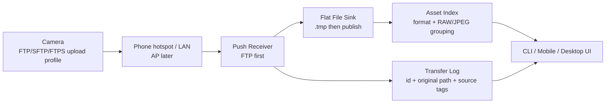

# Camera Connector PRD

## 1. Product Positioning

Camera Connector is a local wireless import receiver for cameras. The current route is push-based: the camera sends JPEG, RAW, and video files to a receiver running on the phone, computer, or later a NAS.

One-line positioning:

> A local camera push import receiver.

## 2. Current Technical Decision

The previous brand-specific PTP/IP pull route is deprecated for this project. Real-camera validation showed that an already-paired workflow can reject a generic direct PTP/IP client and may be owned by an official receiver process. We will not continue reverse pairing or authentication work.

Current priorities:

1. FTP push mode.
2. SFTP push mode.
3. FTPS push mode.
4. AP mode remains the original camera-hotspot meaning, but is paused.

## 3. Users

- Field photographers who need quick local transfer without a card reader.
- RAW+JPEG shooters who need grouped imports and clear file sizes.
- Desktop/NAS users who want repeatable receiver-side ingest.
- Technical validators who need a compatibility table across camera vendors, bodies, and firmware versions.

## 4. Core Scenarios

### 4.1 Phone Hotspot Or LAN FTP Push

1. User starts the receiver on phone/computer.
2. App shows receiver IP, port, protocol, username, and output folder.
3. User configures the camera FTP upload profile.
4. Camera sends files to the receiver.
5. App atomically publishes completed files into a flat inbox and groups RAW/JPEG pairs.

### 4.2 Desktop Batch Receiver

1. User starts FTP receiver on Windows/macOS/Linux.
2. Camera sends selected files or a batch.
3. Receiver writes all completed files into one configured flat folder, regardless of the camera's remote upload path setting.
4. App records transfer id, original camera path, final filename, remote address, and optional user-set source name for filtering and virtual display paths.

### 4.3 AP Mode

AP mode still means the camera creates its own Wi-Fi AP and the phone/computer joins it. This is not part of the current implementation milestone.

## 5. MVP Scope

P0:

- Run a local FTP receiver.
- Print camera-facing receiver settings.
- Accept passive FTP `STOR` uploads.
- Write uploaded files through a temporary file and publish only on success.
- Flatten uploaded paths to the final filename only; do not mirror camera-side folders locally.
- Sanitize uploaded filenames.
- Group RAW/JPEG/video assets by filename stem.
- Recognize common RAW formats across vendors: NEF/NRW, CR2/CR3, ARW/SRF/SR2, RAF, RW2/RWL, ORF, PEF, and DNG.
- Preserve duplicate uploads without overwriting completed files.
- Scan the receiver inbox as the product's import source.
- Record a transfer log for filtering by transfer id, original path, final filename, source name, and remote address.
- Display files as virtual paths such as `Z5_2/BB/DSC_2552.NEF` or `IP-056/BB/DSC_2552.NEF` while keeping local storage flat.
- Let users configure camera accounts with FTP username, password, device name, and optional known IPs.
- Show current and recently connected devices from receiver metadata so newly seen IPs can be bound to an existing account/device instead of typed from memory.
- Record real-camera compatibility results.

P1:

- Add authentication polish.
- Add duplicate detection.
- Add SFTP receiver.
- Add FTPS receiver.

P2:

- Resume AP-mode validation.
- Add mobile foreground/background service behavior.
- Add NAS/headless packaging.

## 6. Non-Goals

- PTP/IP direct import.
- Pairing reverse engineering.
- Remote camera control.
- Live View.
- Camera setting changes.
- Cloud sync.
- RAW decoding or image editing.

## 7. Functional Requirements

| ID | Requirement | Priority | Acceptance |
| --- | --- | --- | --- |
| RX-001 | Start local FTP receiver | P0 | Receiver listens on configured host and port |
| RX-002 | Show receiver settings | P0 | CLI/UI shows protocol, host, port, configured accounts, password status, output folder |
| RX-003 | Accept passive FTP upload | P0 | A client can upload a file through `PASV` + `STOR` |
| RX-004 | Atomic publish | P0 | Final file appears only after full upload succeeds |
| RX-005 | Flat safe path handling | P0 | `/DCIM/100CANON/IMG_1001.CR3` lands as `IMG_1001.CR3`; traversal and unsafe filename characters cannot escape output folder |
| RX-006 | Asset grouping | P0 | Matching JPG and RAW stems such as `IMG_1001.JPG` and `IMG_1001.CR3` appear as one group |
| RX-007 | Inbox scan | P0 | Receiver output folder can be scanned into grouped assets |
| RX-008 | Duplicate policy | P0 | Re-uploading `IMG_1001.CR3` creates `IMG_1001 (1).CR3` |
| RX-009 | Compatibility log | P0 | Each real-camera test updates `docs/compatibility.md` |
| RX-010 | Transfer log | P0 | Each completed transfer records transfer id, original path, final filename/path, bytes, protocol, remote address, and optional source name |
| RX-011 | Tag-style filters and virtual paths | P0 | Inbox and transfer views can filter by format, source name, remote address, transfer id, and original path; display path uses source name or `IP-###` plus original path without creating local subfolders |
| RX-012 | Camera account configuration | P0 | User can list, set, and remove FTP accounts with username, password, device name, and bound IPs; receiver authenticates against these accounts |
| RX-013 | Connected device view | P0 | Receiver records current/recent device IPs, login username, and online state; user can bind a discovered IP to an account/device |
| RX-014 | SFTP route | P1 | Same storage sink can receive SFTP uploads |
| RX-015 | FTPS route | P1 | Same storage sink can receive FTPS uploads |
| AP-001 | Camera AP mode | P2 | Keep original AP meaning; resume after push path works |

## 8. Success Metrics

- FTP receiver accepts a real-camera JPEG upload.
- FTP receiver accepts a real-camera RAW upload.
- Completed files have correct byte length.
- Camera-side upload folders do not create local subfolders.
- Failed uploads do not leave final files.
- Duplicate uploads do not overwrite earlier completed files.
- Transfer log filters can group files by source name, original path, remote address, and transfer id.
- User can configure the camera using only the receiver settings shown by the app.

## 9. Architecture

## 10. Milestones

1. Clean PTP/IP route from code and docs.
2. Build FTP receiver core and CLI smoke path.
3. Validate with one real camera in FTP mode.
4. Update compatibility table and receiver setup guide.
5. Add SFTP or FTPS based on what the real camera supports best.
6. Resume AP-mode exploration only after push import is stable.

