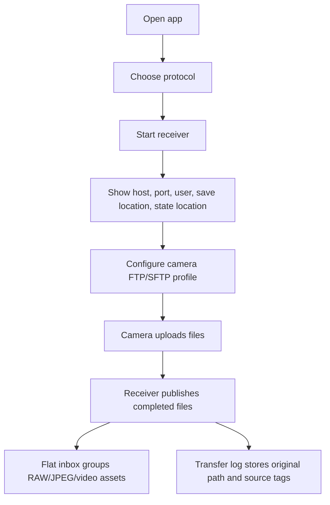

# Camera Connector Prototype Spec

## 1. Prototype Goal

The prototype now presents a push-mode receiver, not a PTP/IP gallery browser. The first screen should help the user start a receiver and copy settings into the camera FTP or SFTP profile.

## 2. Primary Flow

## 3. Screens

### Receiver Screen

Purpose: start and monitor the local receiver.

Content:

- Protocol segmented control: FTP and SFTP.
- Host/IP and port.
- Selected camera account, username, and password status.
- Import save location. Desktop shows a folder; mobile shows the selected media/document destination.
- State/log folder.
- Runtime status from receiver metadata, including stale/offline detection after force quit or crash.
- Start/stop receiver action.
- Firewall/setup warning when needed.

### Camera Setup Screen

Purpose: tell the user what to enter on the camera.

Content:

- Server address.
- Port.
- Login mode.
- Destination folder behavior.
- Passive FTP note.
- Test upload checklist.
- Explanation that camera-side folders are accepted but flattened locally.

### Inbox Screen

Purpose: show files already pushed by the camera.

Content:

- Recent received files.
- RAW+JPEG grouping.
- File format, size, received time.
- Format tabs for all/JPG/RAW/video.
- Tag-style filters for source name, original path, transfer id, and remote IP.
- Virtual display names such as `Z5_2/BB/DSC_2552.NEF`; fall back to `IP-056/...` when no source name is configured.
- Failed/interrupted transfer state.
- Duplicate uploads shown as numbered files, not silent overwrites.
- No local subfolders from camera-side FTP upload paths.

### Transfer Screen

Purpose: show live receive progress.

Content:

- Current upload filename.
- Bytes received.
- Completed, receiving, failed, canceled states.
- Transfer id, original path, source name, and remote IP tags.
- Retry guidance: retry from the camera.

### Settings Screen

Purpose: configure local receiver behavior.

Content:

- Import save location.
- State/log folder for transfer log, connected devices, receiver status, and SFTP host key.
- FTP port.
- Credentials.
- Camera accounts: manage FTP/SFTP username, password status, and device name; passwords are write-only during setup and displayed only as configured/not required.
- Connected devices: show online/recent device IPs and login usernames; IP is a latest-connection property, not account identity.
- Receiver status metadata: show phase, auth mode, bound address, account count, save location, and diagnostic message.
- Storage separation: config, state/logs, and upload inbox are separate.
- Cross-platform storage note: desktop uses a filesystem folder, Android can use MediaStore/SAF, and iOS can use Files/Photos/app sandbox.
- Flat inbox policy.
- Duplicate policy.
- Compatibility log export.

## 4. Visual Direction

- Keep the interface utilitarian and dense.
- Use status pills for receiver state.
- Use icon buttons for copy, refresh, start, stop, and folder actions.
- Avoid marketing hero layouts.
- The first viewport must show receiver status and camera-facing settings.

## 5. Deferred AP Mode

AP mode keeps the original meaning: camera creates Wi-Fi and the device joins it. Do not show AP as the main flow in the current prototype. Keep it as a disabled or future compatibility item.

