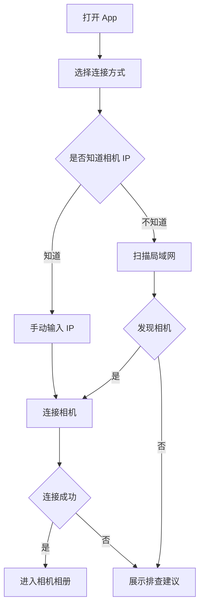
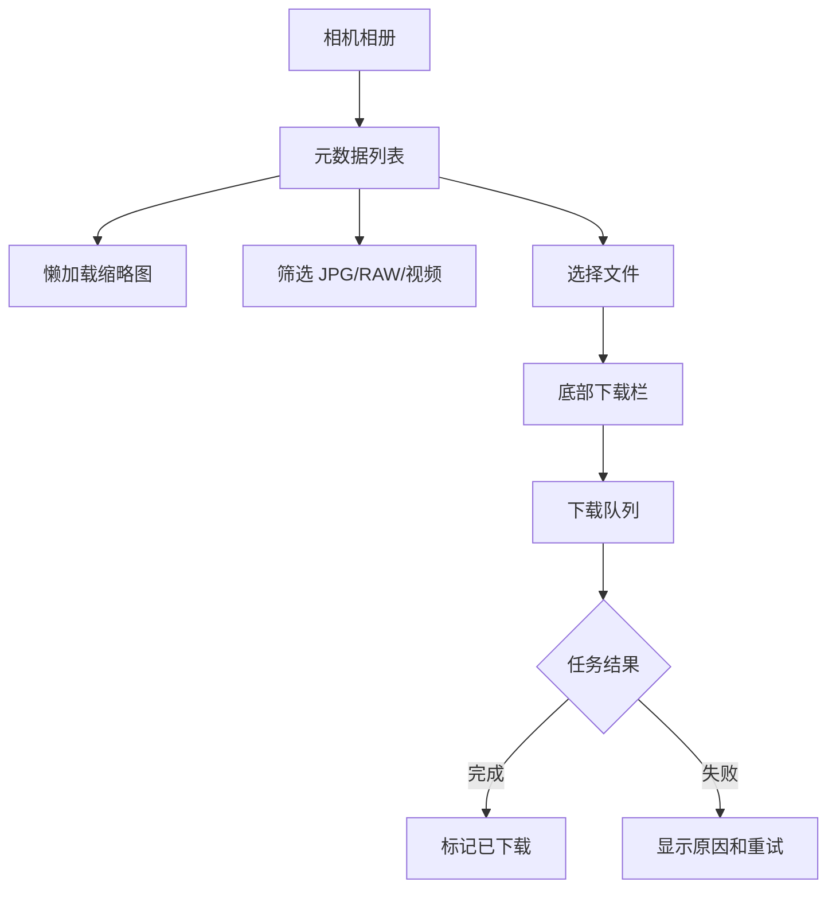

# Nikon Wireless Importer Product Prototype Spec

## 1. 原型目标

这份原型规格用于在 Figma 和 Canva 中完善产品表达：

- Figma：沉淀可交互移动端产品原型、组件、状态和页面流。
- Canva：用于做 PRD 汇报、技术方案路演或项目介绍文档。
- HTML：仓库内提供一个可点击低保真原型，方便不用设计工具也能走通主流程。

当前原型重点覆盖 Android V0.1 到 V0.2，不展开 iOS 和 Desktop 的完整 UI。

## 2. 设计原则

### 2.1 像工具，不像营销页

这是一个导片工具，不是品牌官网。界面应该安静、清楚、可扫描，优先展示连接状态、文件信息、下载状态。

### 2.2 先解释下一步

相机连接流程涉及手机热点、局域网和相机 AP。用户失败时最需要的是下一步动作：

- 去相机菜单连接手机热点。
- 确认相机没有休眠。
- 尝试手动 IP。
- 切换相机 AP 模式。

### 2.3 元数据先到，缩略图后到

列表应先显示文件名、格式、大小、拍摄时间。缩略图渐进出现，失败时用文件类型兜底块。

### 2.4 RAW 文件必须可感知

RAW 体积大，必须在卡片、预览和下载确认里明显展示格式与大小。

## 3. Figma 文件结构

建议 Figma 文件命名：

`Nikon Wireless Importer - Product Prototype`

### 3.1 Pages

| Page | 用途 |
| --- | --- |
| 00 Cover | 项目标题、定位、一句话价值 |
| 01 Flows | 用户流程图和信息架构 |
| 02 Wireframes | 低保真页面 |
| 03 Hi-Fi Android | Android V0.1/V0.2 高保真 |
| 04 Components | 组件库 |
| 05 States | 空状态、加载、错误、权限 |
| 06 Handoff | 标注、文案、技术字段映射 |

### 3.2 Frames

移动端主规格：

- Android compact：`360 x 800`
- Android standard：`390 x 844`
- Tablet optional：`768 x 1024`

### 3.3 Components

基础组件：

- Top bar
- Connection method card
- Status pill
- Segmented filter
- Camera summary row
- File card
- RAW+JPG badge
- Download queue row
- Progress bar
- Error callout
- Primary button
- Secondary icon button

组件状态：

- default
- pressed
- disabled
- loading
- success
- warning
- error

## 4. Canva 交付结构

建议 Canva 用于两类产物：

### 4.1 PRD 汇报 Doc

页面结构：

1. 产品定位。
2. 用户痛点。
3. 核心场景。
4. MVP 范围。
5. 信息架构。
6. 页面原型。
7. 技术架构。
8. 里程碑计划。
9. 风险与应对。
10. V0.1 验收标准。

### 4.2 项目路演 Presentation

建议 8 页：

1. Nikon Wireless Importer。
2. 为什么需要无线读卡器。
3. 三种连接模式。
4. 用户主流程。
5. 产品原型。
6. 技术架构。
7. 路线图。
8. 下一步。

## 5. 用户流程

### 5.1 首次使用

### 5.2 浏览和下载

## 6. 页面规格

### 6.1 Connect Screen

目标：

帮助用户选对连接方式，并完成首次连接。

布局：

- 顶部：产品名、连接状态。
- 状态面板：未连接、扫描中、已发现、连接中、已连接、失败。
- 连接方式：
  - 手机热点，推荐。
  - 同局域网。
  - 相机 AP。
  - 手动 IP。
- 最近连接：展示上次成功 IP。
- 操作区：扫描、连接、重试。

关键文案：

- 标题：连接 Nikon 相机
- 推荐说明：手机开热点，让相机连接热点，手机仍可使用蜂窝网络。
- 手动 IP 占位：例如 `192.168.43.21`
- 失败建议：确认相机已开启 Wi-Fi 或 Connect to PC 模式。

状态：

- Empty：未选择连接方式。
- Scanning：显示扫描进度和已发现设备。
- Connecting：按钮禁用，显示目标 IP。
- Success：显示相机型号和进入相册按钮。
- Error：错误文案加操作建议。

### 6.2 Gallery Screen

目标：

让用户快速浏览和选择文件。

布局：

- 顶部：相机型号、连接模式、文件数量。
- 筛选：全部、JPG、RAW、视频、未下载。
- 排序：拍摄时间倒序、文件名。
- 网格：2 列卡片。
- 底部栏：已选数量、预计大小、下载按钮。

卡片字段：

- 缩略图或文件类型兜底块。
- 文件名。
- 格式角标。
- RAW+JPG 角标。
- 文件大小。
- 已下载标记。

交互：

- 点卡片进入 Preview。
- 长按或勾选进入多选。
- 筛选切换不清空已选，但隐藏项不计入底部可见选择数量。
- 缩略图失败时卡片仍可选和下载。

### 6.3 Preview Screen

目标：

让用户确认具体文件或文件组。

布局：

- 大预览区域。
- 文件信息。
- 同组文件列表：JPEG、RAW、视频。
- 操作按钮：下载 JPEG、下载 RAW、下载整组。

交互：

- 如果只有 JPEG，只展示下载原图。
- 如果是 RAW+JPEG 组，默认推荐下载 JPEG，RAW 需要用户明确选择。
- 大文件下载前显示大小。

### 6.4 Download Screen

目标：

让用户知道下载队列是否正常、安全、可恢复。

布局：

- 顶部总进度。
- 当前下载任务。
- 队列列表。
- 已完成列表。
- 失败列表。

任务字段：

- 文件名。
- 格式。
- 大小。
- 当前状态。
- 进度。
- 操作：取消、重试。

状态：

- Waiting
- Downloading
- Completed
- Failed
- Canceled

### 6.5 Settings Screen

目标：

管理保存位置、连接历史、隐私和诊断。

布局：

- 保存位置。
- 当前相机能力。
- 历史相机。
- 隐私说明。
- 导出诊断日志。

## 7. 原型点击路径

### Path A：手动连接成功

1. Connect。
2. 输入 IP。
3. 点击连接。
4. 成功状态显示 `Nikon Zf`。
5. 进入 Gallery。

### Path B：扫描失败

1. Connect。
2. 点击扫描。
3. 无结果。
4. 展示排查建议。
5. 用户切换手动 IP 或相机 AP。

### Path C：浏览和下载 RAW+JPEG

1. Gallery。
2. 点击 RAW+JPG 卡片。
3. Preview 展示 JPEG 和 NEF。
4. 用户点击下载整组。
5. 进入 Download。
6. 第一个任务完成，第二个任务下载中。

### Path D：下载失败重试

1. Download。
2. 某个 NEF 任务失败。
3. 展示原因：相机休眠或连接中断。
4. 用户点击重试。
5. 任务回到等待队列。

## 8. 视觉方向

### 8.1 色彩

建议采用工具型中性色加少量状态色：

- 背景：`#F6F7F9`
- 主文本：`#1D2430`
- 次文本：`#667085`
- 主操作：`#2563EB`
- 成功：`#168A5B`
- 警告：`#B7791F`
- 错误：`#C2410C`
- RAW 标识：`#7C3AED`

避免大面积品牌色、渐变背景和装饰图形。

### 8.2 字体

- 中文：系统默认无衬线。
- 英文和数字：系统默认。
- 标题不超过 22 px。
- 工具面板内标题 14 到 16 px。
- 文件名允许两行截断。

### 8.3 布局

- 操作区固定在底部或顶部，不遮挡文件列表。
- 卡片半径不超过 8 px。
- 重要状态使用图标、颜色和文字共同表达。
- 不使用大段教学文案，连接引导除外。

## 9. 设计交付清单

Figma 应交付：

- Connect 高保真。
- Gallery 高保真。
- Preview 高保真。
- Download 高保真。
- Settings 中保真。
- 错误状态。
- 空状态。
- 加载状态。
- 组件库。
- 点击原型连接。

Canva 应交付：

- PRD 汇报文档。
- 8 页项目介绍 deck。
- 技术架构图页。
- 路线图页。

仓库已交付：

- `docs/product/PRD.md`
- `docs/product/prototype-spec.md`
- `prototypes/nikon-wireless-importer/index.html`

## 10. 设计评审检查

评审时逐项检查：

- 用户是否能在 10 秒内理解推荐连接方式。
- 失败状态是否给出下一步动作。
- 文件列表没有因为缩略图缺失而不可用。
- RAW 和 JPEG 的关系是否一眼可见。
- 下载中的风险是否清楚，例如相机休眠、网络断开。
- 隐私承诺是否具体，不夸张。
- 页面没有把技术细节暴露给普通用户，除非在诊断页。

