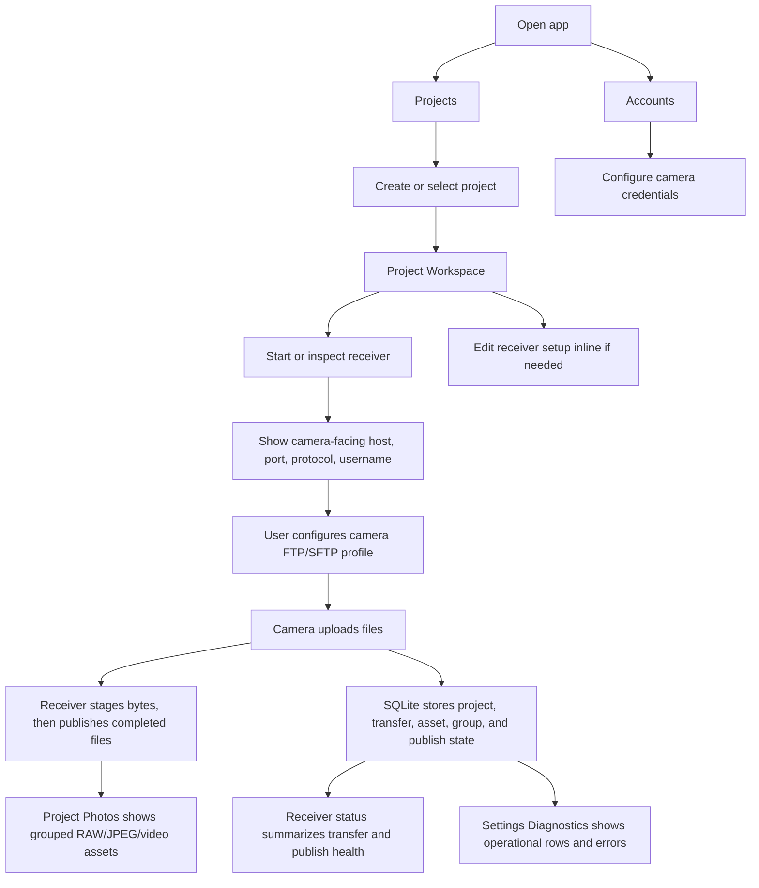

# Camera Connector Prototype Spec

## 1. Prototype Goal

The prototype presents the product shell for a push-mode camera receiver. It is intentionally close to the current core read model so mobile development can map screens to service calls without inventing a second product model.

The early HTML prototype path is:

```text
prototypes/camera-connector/index.html
```

The current Android interaction and visual direction should follow the Figma design:

```text
https://www.figma.com/design/mKSknurwc2LWS83UWe0ReA
```

## 2. Navigation Model

The mobile shell has two navigation levels.

Global navigation:

- Projects
- Accounts
- Settings

Settings secondary navigation:

- Diagnostics

Project workspace:

- Receiver launch/status panel
- Photos grid

This keeps project-scoped work inside a selected shooting project while account management and settings remain global. Diagnostics sit under Settings instead of consuming a primary tab. Receiver start/stop belongs inside the active project workspace so every import has an explicit project boundary.

## 3. Primary Flow



## 4. Screens

### Project Workspace

Purpose: receive into the active project while keeping the photo grid as the main information surface.

Content:

- Receiver launch/status panel: phase, protocol, bind host, port, camera-facing IP, advertised host.
- Stopped state: expanded setup panel with the primary Start action.
- Running state: compact collapsed status with an expand/control affordance.
- Transfer health: total completed and failed count.
- Asset summary: total groups and format counts.
- Current account/device state: account username, device name, online state, active connection count, latest IP/port.
- Recent failures with error text and virtual display path.
- Config/state/output path summary.
- Active project summary.
- Photos grid as the default body below receiver status.

### Projects

Purpose: choose the shooting project used by new imports and dashboard views.

Content:

- Project list with active and archived states.
- Create project.
- Select active project before starting or inspecting imports.
- Explicit project selection before imports; the app does not create a default Inbox fallback.

### Receiver Setup

Purpose: configure local receiver defaults and camera-facing setup values inside the active project workspace.

Entry: expanded project receiver panel.

Content:

- Protocol: FTP or SFTP.
- Bind host, defaulting to `0.0.0.0` for the native listener.
- Unified camera-facing port.
- Camera-facing IP shown to the camera, defaulting to a user-editable `192.168.50.1` style LAN address.
- Read-only camera setup summary: server, port, passive mode, account, password configured state.
Account management is linked from the global Accounts destination, not owned by receiver settings.

### Accounts

Purpose: manage stable device identity and see mutable connection state.

Entry: global destination.

Content:

- Configured accounts: username, device name, password configured state.
- Per-account connection state: online, active connections, latest remote IP, latest port, last seen, last disconnected.
- Recent connected-device records.
- Edit account: device name, username, password setup.
- IP policy: IP is a connection attribute, not account identity.

### Photos

Purpose: show successfully published camera files.

Content:

- Project-scoped asset groups backed by SQLite.
- RAW+JPEG grouping.
- Video groups.
- Photo grid with JPEG preview when available.
- Tap preview to open group detail.
- Long press to enter selection mode for bulk movement.
- Format filters: All, JPG, RAW, Video.
- Tag filters: source name, username, original path, transfer id, remote IP.
- Virtual paths such as `Z5_2/BB/DSC_2552.NEF` or `IP-056/BB/DSC_2552.NEF`.
- Duplicate index/count for repeated imports from the same account/source and original camera path.

### Settings

Purpose: hold global app preferences and secondary operational tools.

Content:

- Output directory selection.
- Photo grid density.
- Diagnostics entry.
- App/runtime preferences that are not project-owned.

### Settings Diagnostics

Purpose: show live and historical operational diagnostics that are not owned by the photo browsing workflow.

Content:

- Current receiver and account health.
- Completed and failed transfer rows when available.
- Failure error text.
- Transfer id, username, source name, original path, remote IP, final location type when exposed by the core.
- Guidance that camera transfer retry is initiated from the camera; publish retry remains available from receiver status when staged bytes can be retried.

## 5. Data Contract Alignment

The prototype maps to `CameraConnectorDashboard`:

- `receiver_status` -> project receiver panel and collapsed status.
- `paths` -> project receiver summary and Settings output fields.
- `accounts` -> project receiver account summary and global Accounts list.
- `devices` -> global Accounts and Settings diagnostics connection records.
- `transfers` -> project receiver health metrics and Settings diagnostics rows.
- `recent_failures` -> project receiver failures and Settings diagnostics failure rows.
- `assets` -> Project Photos grid and shared format/source filters.

Project actions map to `CameraConnectorService::create_project`, `set_active_project`, `active_project`, and `project_dashboard`. On first launch, the app shows project management and requires the user to choose or create a project before uploads can be accepted. Configuration updates map to `CameraConnectorService::set_receiver_settings` and account management maps to `set_account` / `remove_account`.

## 6. Visual Direction

- Keep the interface operational and dense.
- Global navigation should stay compact: Projects, Accounts, Settings.
- Diagnostics should be a Settings secondary page, not a primary tab.
- Project workspace should be photo-first, with receiver launch/status occupying only the space needed for the current receiver state.
- Child pages use a top-left back action.
- Use status pills for receiver, account, and transfer state.
- Use compact cards for repeated items only; avoid landing-page composition.
- Keep long paths and filenames wrap-safe on narrow screens.

## 7. Deferred AP Mode

AP mode keeps the original meaning: camera creates Wi-Fi and the device joins it. It is not part of the current prototype flow and should remain a future compatibility path until FTP/SFTP push import is stable.
