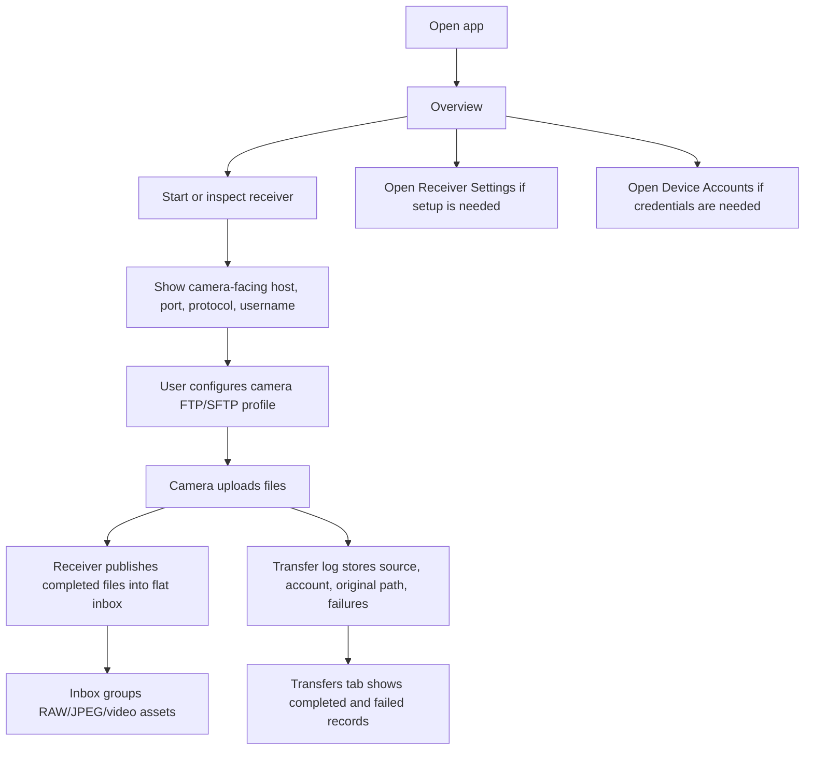

# Camera Connector Prototype Spec

## 1. Prototype Goal

The prototype presents the product shell for a push-mode camera receiver. It is intentionally close to the current core read model so mobile development can map screens to service calls without inventing a second product model.

The prototype path is:

```text
prototypes/camera-connector/index.html
```

## 2. Navigation Model

The primary mobile navigation has three bottom tabs:

- Overview
- Inbox
- Transfers

Configuration and account management are secondary pages, not primary tabs:

- Receiver Settings
- Device Accounts

This keeps the daily workflow focused on receiver health, imported files, and transfer diagnostics. Setup and account management stay reachable from Overview cards and secondary page links.

## 3. Primary Flow



## 4. Screens

### Overview

Purpose: provide the receiver dashboard and operational shortcuts.

Content:

- Receiver status: phase, protocol, bind host, port, advertised host.
- Transfer health: total completed and failed count.
- Asset summary: total groups and format counts.
- Current account/device state: account username, device name, online state, active connection count, latest IP/port.
- Recent failures with error text and virtual display path.
- Config/state/output path summary.
- Entry points to Receiver Settings and Device Accounts.

### Receiver Settings

Purpose: configure local receiver defaults and camera-facing setup values.

Entry: secondary page from Overview.

Content:

- Protocol: FTP or SFTP.
- Bind host.
- FTP port.
- SFTP port.
- Advertised host shown to the camera.
- Source name.
- Upload/output location.
- State/log location.
- Read-only camera setup summary: server, port, passive mode, account, password configured state.
- Link to Device Accounts.

### Device Accounts

Purpose: manage stable device identity and see mutable connection state.

Entry: secondary page from Overview or Receiver Settings.

Content:

- Configured accounts: username, device name, password configured state.
- Per-account connection state: online, active connections, latest remote IP, latest port, last seen, last disconnected.
- Recent connected-device records.
- Edit account: device name, username, password setup.
- IP policy: IP is a connection attribute, not account identity.

### Inbox

Purpose: show successfully published camera files.

Content:

- Flat inbox assets backed by transfer log or storage scan.
- RAW+JPEG grouping.
- Video groups.
- Format filters: All, JPG, RAW, Video.
- Tag filters: source name, username, original path, transfer id, remote IP.
- Virtual paths such as `Z5_2/BB/DSC_2552.NEF` or `IP-056/BB/DSC_2552.NEF`.
- Duplicate index/count for repeated imports from the same account/source and original camera path.

### Transfers

Purpose: show live and historical transfer diagnostics.

Content:

- Current upload progress when available.
- Completed and failed transfer rows.
- Failure error text.
- Transfer id, username, source name, original path, remote IP, final location type.
- Status filter: all, completed, failed.
- Guidance that retry is initiated from the camera.

## 5. Data Contract Alignment

The prototype maps to `CameraConnectorDashboard`:

- `receiver_status` -> Overview receiver card.
- `paths` -> Overview path summary and Receiver Settings path fields.
- `accounts` -> Overview account summary and Device Accounts list.
- `devices` -> Device Accounts connection records.
- `transfers` -> Overview transfer health metrics.
- `recent_failures` -> Overview recent failures and Transfers failure rows.
- `assets` -> Inbox asset groups and format/source filters.

Configuration updates map to `CameraConnectorService::set_receiver_settings` and account management maps to `set_account` / `remove_account`.

## 6. Visual Direction

- Keep the interface operational and dense.
- Bottom tabs are only stable primary destinations.
- Secondary pages use a top-left back action.
- Use status pills for receiver, account, and transfer state.
- Use compact cards for repeated items only; avoid landing-page composition.
- Keep long paths and filenames wrap-safe on narrow screens.

## 7. Deferred AP Mode

AP mode keeps the original meaning: camera creates Wi-Fi and the device joins it. It is not part of the current prototype flow and should remain a future compatibility path until FTP/SFTP push import is stable.
