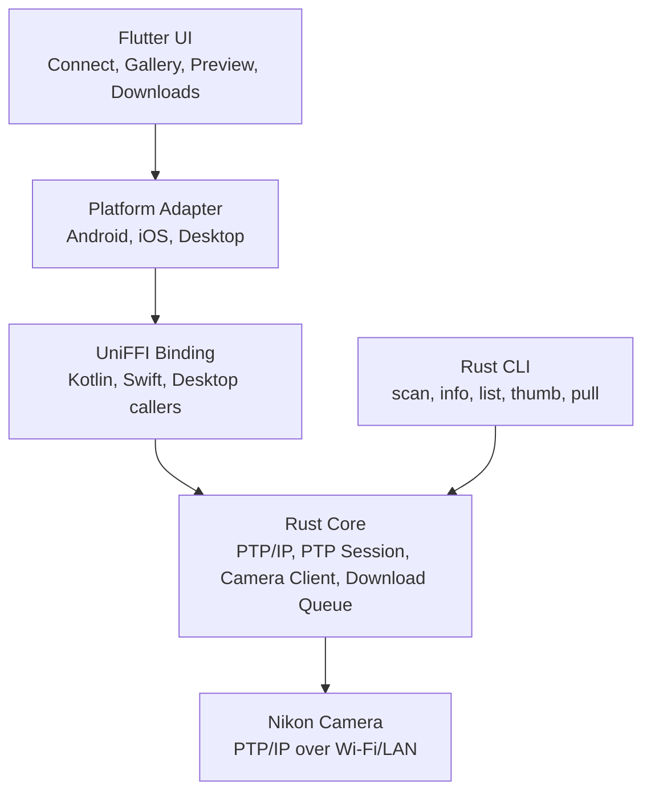

# Nikon Wireless Importer Technical Design

## 1. Scope

Nikon Wireless Importer is a focused wireless import tool for Nikon cameras. It should let a phone or computer discover a camera on Wi-Fi/LAN, inspect photos on the camera card, preview thumbnails, select files, and download originals without USB, a card reader, or a full SnapBridge replacement workflow.

The first shippable target is not a polished cross-platform app. The first target is a proven protocol loop against a real camera:

1. Discover or manually connect to a Nikon camera.
2. Open a PTP/IP session on port `15740`.
3. Read camera/device information.
4. Enumerate storage and objects.
5. Fetch thumbnails.
6. Download one JPEG and one NEF reliably.

Once this loop works in a Rust CLI, mobile UI and platform storage work can be built with much lower risk.

## 2. Product Positioning

### One-line Positioning

A wireless card reader for Nikon cameras.

### Primary Users

- Photographers who want quick selective import in the field.
- Travelers who want the phone to keep internet connectivity while importing.
- Desktop/NAS users who want automatic or incremental import later.
- Developers validating Nikon PTP/IP behavior across camera models.

### Core Scenarios

#### Scenario A: Phone Hotspot Mode

Recommended main flow:

1. The phone enables hotspot and keeps 4G/5G internet access.
2. The Nikon camera connects to the phone hotspot as a Wi-Fi client.
3. The app scans the hotspot subnet or uses the last known camera IP.
4. The app connects to the camera via PTP/IP and imports files.

Benefits:

- Phone does not lose internet access.
- Good for outdoor and travel use.
- Works well when the camera supports infrastructure/client Wi-Fi mode.

Limitations:

- User must configure the camera to connect to the phone hotspot.
- App must discover the camera IP assigned by the phone.

#### Scenario B: Home/Office LAN Mode

1. Phone or computer connects to the same Wi-Fi/LAN as the camera.
2. Camera joins the same network.
3. App scans the LAN and connects.

Benefits:

- Stable for batch import.
- Best desktop and NAS story.

Limitations:

- Less useful outdoors.
- Nikon menu paths differ by model.

#### Scenario C: Camera AP Mode

1. Camera exposes its own Wi-Fi access point.
2. Phone connects to the camera Wi-Fi.
3. App tries the default camera host, usually `192.168.1.1:15740`.

Benefits:

- Does not require a router.
- Useful compatibility fallback.

Limitations:

- Phone Wi-Fi is occupied and may lose internet.
- Android may warn that the Wi-Fi has no internet.

## 3. Recommended Architecture

### Recommended Approach

Use a Rust protocol core, prove it through a CLI first, then expose it to Flutter mobile apps through a platform adapter layer and UniFFI.



Why this approach:

- PTP/IP is binary, stateful, and networking-heavy. Rust is a good fit.
- CLI validation avoids spending weeks on mobile UI before knowing the camera protocol works.
- UniFFI allows the same core to be reused by Android, iOS, desktop, CLI, and future NAS importers.
- Platform-specific features stay outside the protocol core, especially Android network selection and file publishing.

### Alternatives Considered

#### Alternative 1: Pure Flutter/Dart

Pros:

- Simple app structure.
- Faster UI iteration.

Cons:

- Weak fit for binary protocol parsing, socket lifecycle control, platform-specific routing, long downloads, and future CLI/NAS reuse.
- iOS and Android still need native layers for permissions and storage.

Verdict: not recommended.

#### Alternative 2: Android-native First

Pros:

- Fastest path to an Android demo.
- Direct access to Android networking and MediaStore.

Cons:

- iOS, desktop, and CLI would duplicate protocol logic.
- Harder to build a stable cross-platform core later.

Verdict: acceptable only for a throwaway prototype.

#### Alternative 3: Rust Core plus CLI First

Pros:

- Best risk reduction.
- Protocol can be tested against real and mock cameras.
- Mobile UI work builds on proven APIs.

Cons:

- More upfront scaffolding.
- Requires Rust async, FFI, and mobile integration discipline.

Verdict: recommended.

## 4. Target Phases

### V0.0: Protocol Validation CLI

Goal: prove the real camera can be accessed.

Features:

- `nikon-importer scan`
- `nikon-importer info --host <ip>`
- `nikon-importer list --host <ip>`
- `nikon-importer thumb --host <ip> --handle <id>`
- `nikon-importer pull --host <ip> --handle <id> --output <dir>`

Acceptance:

- Connects to a real Nikon camera on `15740`.
- Outputs camera model and firmware when available.
- Lists at least recent image/video objects.
- Downloads at least one JPEG and one NEF.

### V0.1: Android Manual Connection Demo

Goal: validate mobile integration with minimal UX.

Features:

- Manual IP entry.
- Connect and show camera info.
- List objects.
- Load visible thumbnails.
- Download one selected object to app-private storage or public media directory.

Acceptance:

- Works in phone hotspot mode or same-LAN mode.
- Errors are human-readable.
- No full background download commitment yet.

### V0.2: Android Complete Import Experience

Goal: make Android useful for real import sessions.

Features:

- LAN scan and last successful IP shortcut.
- RAW+JPEG grouping.
- Filters: all, JPG, RAW, video, not downloaded.
- Batch download queue.
- Progress, cancel, retry.
- MediaStore save.
- Foreground service for longer downloads.

### V0.3: iOS

Goal: bring the proven flow to iPhone.

Features:

- Local Network permission handling.
- Manual IP and LAN scan.
- Object list, thumbnails, selected downloads.
- JPEG to Photos, NEF/video to Files/App Documents.

Constraint:

- First iOS release should only promise foreground downloads.

### V0.4: Desktop and Automation

Goal: support bulk import and automation.

Features:

- macOS, Windows, Linux GUI or CLI packaging.
- Save to selected directory.
- Date-based folders.
- Incremental sync and skip-existing.
- NAS-friendly headless mode.

## 5. Repository Structure

Recommended initial structure:

```text
nikon-wireless-importer/
  core/
    Cargo.toml
    src/
      lib.rs
      error.rs
      model/
      ptp_ip/
      ptp/
      camera/
      download/
      scanner/
      log/
    tests/
  tools/
    cli/
      Cargo.toml
      src/main.rs
    mock_camera/
      Cargo.toml
      src/main.rs
  bindings/
    uniffi.toml
    nikon_importer.udl
  apps/
    mobile_flutter/
      pubspec.yaml
      lib/
      android/
      ios/
    desktop_flutter/
  docs/
    protocol.md
    compatibility.md
    troubleshooting.md
```

If the project starts from an empty repository, create only `core`, `tools/cli`, `tools/mock_camera`, and `docs` first. Add Flutter after the CLI can talk to either the mock camera or a real camera.

## 6. Core Domain Model

### CameraEndpoint

Represents a candidate camera host.

Fields:

- `host: String`
- `port: u16`
- `source: EndpointSource`

Endpoint sources:

- `Manual`
- `LanScan`
- `CameraApDefault`
- `PreviousSuccessful`

### CameraInfo

Fields:

- `manufacturer`
- `model`
- `serial_number`
- `firmware_version`
- `supported_operations`
- `supported_formats`

### CameraObject

Fields:

- `handle`
- `storage_id`
- `filename`
- `size_bytes`
- `format`
- `capture_time_ms`
- `modified_time_ms`
- `width`
- `height`
- `thumb_available`
- `downloaded`
- `group_key`

Object formats:

- `Jpeg`
- `Nef`
- `Mov`
- `Mp4`
- `Tiff`
- `Unknown`

### CameraAssetGroup

Groups related files into one UI item:

- `DSC_1234.JPG`
- `DSC_1234.NEF`

Result:

- `group_key = "DSC_1234"`
- UI card shows a `RAW+JPG` badge.

Grouping should be implemented in core so CLI, mobile, and desktop behave consistently.

## 7. PTP/IP Design

### Connection Model

PTP/IP uses two TCP connections:

- Command/Data connection: sends commands and receives data.
- Event connection: receives camera events.

Default Nikon PTP/IP port:

- `15740`

Initial flow:

```text
TCP connect camera_host:15740
Send InitCommandRequest
Receive InitCommandAck
Open second TCP connection
Send InitEventRequest
Receive InitEventAck
OpenSession
GetDeviceInfo
```

### Minimum Operation Set

V0.0/V0.1 should implement:

- `GetDeviceInfo = 0x1001`
- `OpenSession = 0x1002`
- `CloseSession = 0x1003`
- `GetStorageIDs = 0x1004`
- `GetStorageInfo = 0x1005`
- `GetObjectHandles = 0x1007`
- `GetObjectInfo = 0x1008`
- `GetObject = 0x1009`
- `GetThumb = 0x100A`

### Packet and Dataset Strategy

Core must separate:

- PTP/IP packet framing.
- PTP operation containers.
- PTP response parsing.
- Dataset parsing such as DeviceInfo, StorageInfo, ObjectInfo.

This keeps parser tests small and allows mock camera responses to cover edge cases.

### Object Enumeration Flow

```text
OpenSession
GetStorageIDs
for each storage_id:
  GetStorageInfo
  GetObjectHandles(storage_id)
  for each object_handle:
    GetObjectInfo(handle)
filter supported formats
sort by capture time descending, fallback to filename
group RAW+JPEG
```

### Thumbnail Strategy

Rules:

- Never fetch all thumbnails at once.
- Fetch visible range first.
- Limit thumbnail concurrency to `2..4`.
- Cache thumbnails by `handle + filename + size`.
- Treat thumbnail failure as non-fatal.

### Download Strategy

Rules:

- Original downloads default to concurrency `1`.
- Write to `filename.tmp`.
- Verify byte count when possible.
- Rename or publish only after success.
- V0.1 retries from the beginning on failure.
- Do not promise reliable resume unless camera support is proven.

## 8. Platform Adapter Design

### Android

Networking:

- Use `ConnectivityManager` to inspect available networks.
- For camera sockets, use a specific `Network.socketFactory` when needed.
- Avoid global `bindProcessToNetwork`, because it can route all app traffic to a no-internet Wi-Fi.

Discovery:

- Prefer last successful IP.
- Scan current subnet first.
- Fallback candidate ranges:
  - `192.168.1.0/24`
  - `192.168.0.0/24`
  - `192.168.43.0/24`
  - `192.168.231.0/24`
  - `172.20.10.0/28`
- Timeout per host: `200..500 ms`.
- Concurrency: `32..64`.

Storage:

- Android 10+: MediaStore.
- JPEG: `Pictures/NikonImporter/YYYY-MM-DD/`
- NEF: `Pictures/NikonImporter/RAW/YYYY-MM-DD/`
- Video: `Movies/NikonImporter/YYYY-MM-DD/`

Background:

- V0.1 can require foreground app.
- V0.2 should use Foreground Service for batch downloads.

### iOS

Permissions:

- Configure `NSLocalNetworkUsageDescription`.
- Add `NSBonjourServices` only if Bonjour/mDNS is introduced.

Networking:

- Rust core can use TCP.
- Native layer should trigger permissions and expose network status.
- Use Network.framework later if lower-level control is required.

Storage:

- JPEG can be saved to Photos.
- NEF/video should default to Files/App Documents.

Background:

- Do not promise long-running background import in the first iOS release.

### Desktop

Networking:

- Direct Rust TCP.
- LAN scan and manual IP.

Storage:

- Default: `~/Pictures/NikonImporter/YYYY-MM-DD/`
- Allow custom output path.

CLI:

- The CLI is both a user tool and the protocol validation harness.

## 9. User Experience Requirements

### Connect Screen

Modes:

- Auto scan LAN.
- Manual IP.
- Camera AP mode.

States:

- Not connected.
- Scanning.
- Found.
- Connecting.
- Connected.
- Failed.

Primary copy:

- Recommend phone hotspot mode first.
- Explain camera AP mode as compatibility fallback.

### Gallery Screen

Controls:

- Filter: all, JPG, RAW, video, not downloaded.
- Sort: capture time descending, filename.
- View: grid first; masonry can come later.
- Bottom bar: selected count and download original.

Cards:

- Thumbnail or fallback file tile.
- Filename.
- RAW+JPG badge.
- Size.
- Downloaded mark.

### Preview Screen

Features:

- Larger preview when thumbnail exists.
- File metadata.
- Download JPEG.
- Download RAW.
- Download whole group.

### Download Screen

States:

- Waiting.
- Downloading.
- Completed.
- Failed.
- Canceled.

Actions:

- Cancel.
- Retry.
- Open save location where platform allows.

## 10. Errors

Core error enum:

- `NetworkUnavailable`
- `CameraNotFound`
- `ConnectionTimeout`
- `PtpInitFailed`
- `SessionOpenFailed`
- `UnsupportedOperation`
- `ObjectNotFound`
- `ThumbnailUnavailable`
- `DownloadInterrupted`
- `StoragePermissionDenied`
- `LocalNetworkPermissionDenied`
- `UnknownCameraResponse`
- `InternalError`

User-facing copy:

- `CameraNotFound`: "没有发现相机。请确认相机已经连接到手机热点或同一个 Wi-Fi，然后重新扫描。"
- `ConnectionTimeout`: "连接超时。相机可能已经休眠，或当前网络无法访问相机。"
- `LocalNetworkPermissionDenied`: "需要允许访问本地网络，App 才能发现和连接相机。"
- `ThumbnailUnavailable`: "这张照片无法读取缩略图，但仍然可以尝试下载原文件。"
- `DownloadInterrupted`: "下载中断。请保持相机开启并靠近手机，然后重试。"

## 11. Performance Targets

- After connection, show metadata list within `3 s` for typical card sizes.
- Show first-screen thumbnails within `10 s`.
- Initial object listing may cap at recent `300` objects, with load-more support.
- Thumbnail concurrency: `2..4`.
- Original download concurrency: `1`.
- LAN scan should progressively show candidates rather than waiting for the full scan.

## 12. Security and Privacy

Rules:

- No cloud upload by default.
- Do not log image bytes.
- Do not log full private EXIF payloads.
- Do not log precise GPS coordinates.

Allowed logs:

- Camera model.
- Firmware version.
- Connection mode.
- Error code.
- File format counts.
- Download duration.

First-run explanation:

"本 App 需要访问局域网设备，用于发现和连接你的相机。照片只会在你的设备和相机之间传输。"

## 13. Testing Strategy

### Unit Tests

Rust core:

- PTP/IP packet encode/decode.
- Operation container encode/decode.
- Response code parsing.
- DeviceInfo dataset parsing.
- StorageInfo dataset parsing.
- ObjectInfo dataset parsing.
- Object format detection.
- RAW+JPEG group key generation.
- Error mapping.

### Mock Camera

Build a local mock server on `localhost:15740` that simulates:

- InitCommandAck.
- InitEventAck.
- GetDeviceInfo.
- GetStorageIDs.
- GetObjectHandles.
- GetObjectInfo.
- GetThumb.
- GetObject.
- Timeout and malformed response paths.

Uses:

- CI.
- UI development without a real camera.
- Regression tests for parser and retry behavior.

### Real Camera Matrix

Track each test in `docs/compatibility.md`:

- Camera model.
- Firmware version.
- Connection mode.
- Can open `15740`.
- Can init command connection.
- Can init event connection.
- Can GetDeviceInfo.
- Can GetThumb.
- Can GetObject.
- Large file stability.

Minimum matrix:

- Android phone plus phone hotspot.
- Android phone plus home Wi-Fi.
- Android phone plus camera AP.
- iPhone plus home Wi-Fi.
- iPhone plus phone hotspot.
- Desktop plus home Wi-Fi.

### Stress Tests

- Enumerate 1000 objects.
- Load 100 thumbnails while scrolling.
- Batch download 50 JPEG files.
- Batch download 10 NEF files.
- Camera sleeps during download.
- Wi-Fi disconnects during download.
- App backgrounds during download.

## 14. Compatibility Strategy

After connection, run a capability probe:

```text
GetDeviceInfo
Read manufacturer/model/supported_operations/supported_formats
Build CameraCapability
```

Capability fields:

- `supports_get_thumb`
- `supports_get_object`
- `supports_storage_info`
- `supports_raw_download`
- `supports_video_download`

The app should degrade gracefully. If thumbnails fail, list files with fallback file tiles. If RAW download is unsupported, hide RAW-specific actions and explain the limitation.

## 15. Non-goals for V0.1

V0.1 should not include:

- Remote shooting.
- Live View.
- Camera setting changes.
- BLE wake-up.
- Cloud sync.
- Image editing.
- RAW decoding/editing.
- Full EXIF manager.
- Guaranteed compatibility with every Nikon model.
- Reliable resumable downloads unless proven by protocol support.

## 16. Main Risks

### Risk 1: Some Nikon Models Do Not Expose PTP/IP

Mitigation:

- Keep a compatibility table.
- Support confirmed models first.
- Offer camera AP and manual IP fallbacks.
- Avoid blanket compatibility claims.

### Risk 2: Camera Requires SnapBridge BLE Wake-up

Mitigation:

- V0.1 requires the user to manually enable Wi-Fi or "connect to PC" mode.
- BLE wake-up is a later research track.

### Risk 3: Large File Downloads Drop

Mitigation:

- Limit original download concurrency to `1`.
- Use timeout and keep-alive policy.
- Retry failed tasks.
- Write temporary files and publish only after success.

### Risk 4: iOS Background Restrictions

Mitigation:

- First iOS release only promises foreground downloads.
- Show clear UI guidance during large downloads.

### Risk 5: LAN Scan Is Slow

Mitigation:

- Try last successful IP first.
- Scan current subnet before fallback subnets.
- Use bounded concurrency.
- Stream results to UI.

## 17. Acceptance Criteria

### V0.0 CLI

- `scan` finds a reachable mock camera and at least one real camera model when available.
- `info` prints manufacturer, model, and supported operation count.
- `list` prints handles, filenames, sizes, and formats.
- `thumb` writes a JPEG thumbnail file when supported.
- `pull` downloads one object to disk and validates size.

### V0.1 Android Demo

Given a supported Nikon camera:

1. Phone hotspot is enabled.
2. Camera joins phone hotspot.
3. App connects by manual IP or scan.
4. App shows camera model.
5. App shows recent photo list.
6. App loads visible thumbnails progressively.
7. User downloads a JPEG.
8. User downloads a NEF.
9. Files are saved locally.
10. Failed download can be retried.

## 18. Key Decisions

- Build Rust CLI first.
- Keep PTP/IP and PTP operation parsing independent from UI and platform storage.
- Use UniFFI after the Rust API stabilizes.
- Use Android manual IP before automatic discovery.
- Do not implement BLE wake-up in the first release.
- Do not promise resumable downloads until real cameras prove support.
- Treat thumbnails as optional and non-blocking.
